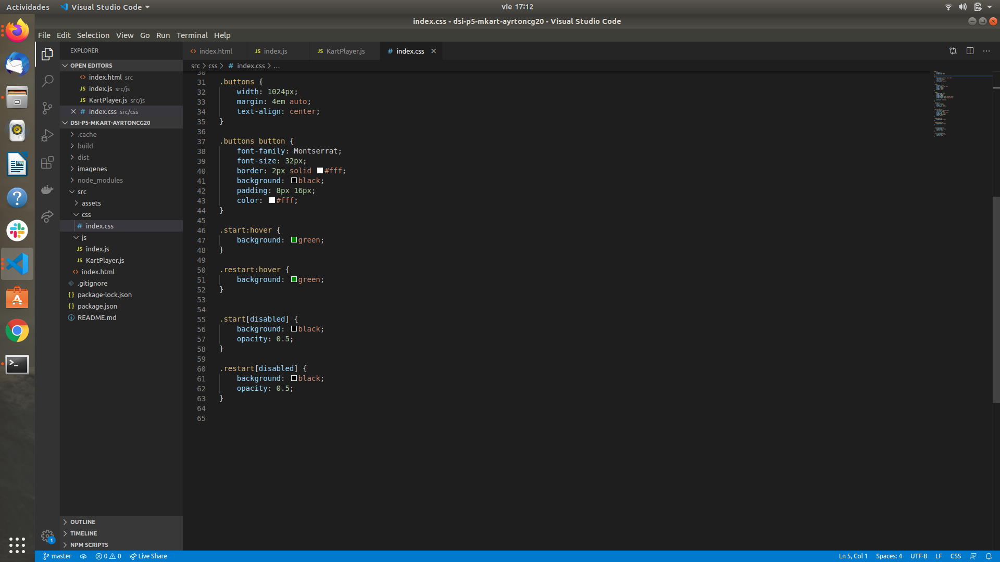

### Práctica 5: Mario Kart


En esta práctica vamos a crear una pequeña carrera de Mario Kart. Para ello, utilizaremos WebComponents para encapsular conceptos clave de la práctica, como los kart de cada personaje. De esta forma, podríamos crear un WebComponent llamado KartPlayer. Este componente es similar al concepto de clases en programación (de hecho, extiende de HTMLElement), y se recomienda que se vea como una extensión para crear una etiqueta HTML propia y personalizada a la que le daremos funcionalidad y apariencia.

La idea es que nuestra etiqueta HTML <kart-player> (o componente KartPlayer), incluya, maneje y controle datos del kart para encapsular su funcionamiento y hacernos más fácil y cómodo trabajar con él, sin que repercuta con el resto de la página. Cosas que podría controlar el componente podrían ser las siguientes:

- Incluir un nombre identificatorio del kart
- Incluir una imagen (asset) para representar visualmente el vehículo en la página. Usa el nombre kart-personaje.png, donde personaje es el nombre del mismo.
- Incluir los números de coordenadas del eje x y el eje y del kart en cuestión, para saber donde dibujarlo.
- Gestionar su código HTML y CSS asociado, en el interior del componente

Ten en cuenta que la idea es dibujar el kart en las coordenadas (x, y). A medida que avance la carrera, iremos aumentando el valor x y la carrera termina cuando llegue a 950 (o el número definido como línea de meta). Para esto, en la parte visual, nos podemos ayudar de la propiedad transform: translate() de CSS y utilizar custom properties (variables CSS) con var(--nombre-variable).

1. La carrera debería tener un botón Start que comenzará la carrera hasta que uno de los Karts llegue a la meta (condición para terminar la carrera). Dicha condición podría ser cuando x sea 950, por ejemplo.

2. Sería recomendable utilizar ShadowDOM para encapsular el HTML y CSS del componente y no afecte a otros karts. Una buena forma de organizarlo puede ser la siguiente (fragmento del componente KartPlayer):

```
export class KartPlayer extends HTMLElement {
   ...

   get styles() {
   return `
      :host {
        position: absolute;
        display: inline-block;
        left: 0;
        top: ${this.y}px;
        transform: translateX(var(--x)) translateY(var(--y));
        transition: transform 0.25s;
        will-change: transform;
      }
      ...
    `;
   }

   render() {
      this.shadowRoot.innerHTML = `
         <style>${this.styles}</style>
         <item-kart></item-kart>
         
       `;
   }
   ...
}
```


3. Sería interesante crear métodos de ayuda para el componente, que afecten al propio kart. Por ejemplo, una propuesta:

- Un método .inc() que incrementa la cantidad que avanza el kart
- Un método .setSpeed() que determina la velocidad que tomará el kart a partir de ese momento
- Un método .win() y otro .lose() que establece el kart en cuestión como vencedor o perdedor (añadiendo alguna clase al HTML y activando algún efecto visual para destacarlo)
- Un método .isWinner() que comprueba si un kart es un ganador.

4. En el archivo index.js principal se puede desarrollar la actividad general del juego. Se aconseja seguir un enfoque funcional, creando pequeñas funciones (arrow functions) que hagan tareas concretas. Por ejemplo:

- startRace()
- endRace()
- restartRace()
- startIteration()
- etc...

5. La idea principal del juego es ejecutar una función (startIteration()) cada 1000 / 60 segundos (aproximadamente, 60fps), hasta que se cumpla un criterio específico que determine que ha finalizado el juego. Pista: Usar timers.

Para abordar esta práctica, pueden utilizar la imagen que ha diseñado un usuario en DeviantArt, basándose en los del juego original de SNES. Lo ideal sería dividirlos en varias imágenes (deben haber 6 jugadores) de 128x128 de resolución, donde la imagen esté centrada y pegada a la parte inferior:

- Source: Sprites Mario Kart

Criterios importantes

- Aspecto visual y uso de imágenes (6 jugadores)
- Encapsulación con WebComponents
- Uso de ShadowDOM
- Uso de custom properties CSS (variables CSS)
- La carrera empieza y termina correctamente (detectando al ganador)

Retos

1. Como reto opcional, se puede añadir la posiblidad aleatoria (Math.random()) de que en cada iteración, un kart obtenga un item. Si obtiene un plátano, la velocidad desciende a cero temporalmente, manteniendo el kart en el mismo sitio al resbalar con el plátano. Si obtiene un champiñón, la velocidad asciende temporalmente, haciendo que vaya más rápido durante un tiempo.

2. ¿Se te ocurre alguna funcionalidad extra para el juego? Impleméntala y documéntala en el README.

### Explicación

Antes de comenzar la práctica como hemos visto en prácticas anteriores, creamos el directorio de trabajo y tenemos que hacer uso de git por lo que utilizamos el comando:

```
$ git init
```

Para iniciar un repositorio. Para conectar nuestro directorio con el respositorio del github utilizamos el siguiente comando:

```
$ git remote add origin <ruta_ssh>
```

A continuación creamos el package.json con el comando:

```
$ npm init -y
```

Y por último, instalamos parcel de forma local:

```
$ npm install -D parcel-bundler
```

Lo primero que hicimos fue ver todos los videos para entender perfectamente que era Webcomponent y poder avanzar con la práctica. Creamos los directorios correspondientes.

```
src
   assets
   js
      index.js
      kartplayer.js
   css
      index.css
   index.html
```

Comenzamos explicando el index.html, como en las anteriores prácticas he creado un titulo para que tenga titulo la práctica. Dentro del body he creado un texto el cual va a salir por pantalla definiendo de que va a tratar la práctica, también declaramos un div llamado race y un div llamado road. Despúes declaramos una clase boton que contendra el boton start y el bton restart. 

```
<h1>Mario Kart</h1>
    <!--Creamos el titulo de la página-->
    <div class="race">
        <!--Creamos un div para la carrera-->
        <div class="road"></div>
        <!--Creamos un div para la carretera-->
    </div>
    <div class="buttons">
        <!-- Creamos un div para los botones en este caso start y restarts-->
        <button class="start">Start</button>
        <button class="restart">Restart</button>
    </div>
```

En la siguiente imagen podemos observar el código:


Ahora nos dirigimos al index.js archivo dado por el profesor que vamos a explicar a continuación:

Lo primero que tenemos que hacer es importar las imagenes de los kart asi como la clase KartPlayer.

```
import players from '../assets/kart-*.png' // importamos los kart como players
import { KartPlayer } from './KartPlayer.js' // importamos la clase Kartplayer
```

Comenzamos creado constantes para los dos botones, una para el start y otra para el restart. 
También creamos una constante para la carretera. 
Creamos un array para meter los kart
Por ultimo creamos una variable timer a null. 

```
const startButton = document.querySelector('.start') // creamos una constante para guardar el boton start
const restartButton = document.querySelector('.restart') // Creamos una constante para guardar el boton restart
const road = document.querySelector('.road') // Creamos una constante para la carretera
const karts = [] // array para los kart
let timer = null
```

Comenzamos creando un for donde se va a recorrer el nombre y la imagen de cada objeto players al cual le vamos a decir que dentro de config esta la imagen y la posicion y de los kart. 
```
for (const [name, image] of Object.entries(players)) { // recorremos el objeto player que tiene el nombre del kart
  const config = {
    image,
    y: karts.length * 64 // posicion y de cada kart
  }
```

A continuación creamos un objeto kart que le pasamos por parametro el nombre del kart y el array config que contiene la imagen y la posicion y del kart. 

```
const kart = new KartPlayer(name, config) // Creamos un nuevo kart con el nombre y un array de configuracion donde esta la imagen y la posicion y
```

Añadimos el kart a la carretera con la funcion addToRoad definida en la clase KartPlayer y le pasamos por parametro la constante road que tendra la clase road creada en el html. 

```
kart.addToRoad(road) // añadimos el kart a la carretera
```

Por último metemos el kart dentro del array creado al comienzo del fichero. 

```
karts.push(kart) // Metemoe el kart en el array de kart
```

Comenzamos a explicar las funciones:

```
const startRace = () => { // Funcion para comenzar la carrera
  timer = setInterval(() => startIterarion(), 1000 / 60)
  startButton.disabled = true
  restartButton.disabled = true
}

```
Funcion para comenzar la carrera, dicha funcion llama a starIteration que la explicaremos a continuación, los botones los ponemos deshabilitados para que el usuario no pueda pulsar mientras se esta desarrollando la carrera. 

```
const endRace = () => { // funcion para acabar la carrera
  clearInterval(timer)
  karts.forEach(kart => (kart.isWinner() ? kart.win() : kart.lose()))
  restartButton.disabled = false
}

```

La función endRace para acabar la carrera, se hace un for para recorrer todos los karts del array, se llama a isWinner que es una función declarada dentro de la clase KartPlayer para saber si un kart ha ganado o no, como sabesmo eso, si la x del kart ha llegado a 930 entonces el kart ha ganado la carrera. Luego se hace una especie de if para saber si ese kart es el ganador o es uno de los perdedores para darle estilos. 
El boton de restablecer se pone visible otra vez para poder restablecer la carrera una vez ya ha sido terminada. 

```
const restartRace = () => { // funcion para restablecer la carrera
  karts.forEach(kart => kart.restart())
  startButton.disabled = false
}

```

Funcion para restablecer la carrera, se llama a una funcion restar definida en kartplayer que pone la variable x de todos los kart a 0 para empezar otra vez en la posicion 0. 
El boton de estar se pone visible para poder iniciar de nuevo la carrera. 

```

const startIterarion = () => { // funcion para avanzar los kart en cada iteracion
  karts.forEach(kart => kart.inc())
  if (karts.some(kart => kart.isWinner())) endRace()
}

```

Función para mover los karts de posicion, llamamos a inc() que es una funcion definida dentro de kartplayer que lo que hace es sumarle una cantidad a la x de cada kart entre 0 y 5 aleatoriamente para que el kart vaya cambiando su posicion x y se vaya moviendo hacia la meta. 

Por último si le damos a startButton llamamos a la funcion comenzar carrera, mientras que, si le damos a restartButton llamamos a la funcion restart carrera. 

```
startButton.onclick = () => startRace() // si le damos click a start llamamos a la funcion que empieza la carrera
restartButton.onclick = () => restartRace()
```


Ahora vamos a comentar la clase KartPlayer.

Lo primero que hacemos es definir una clase que extiende de HTML para hacer uso de WebComponent. 




Con lo visto en todo el código anterior se puede hacer una carrera de mario kart utilizando webcomponent. 
```
export class KartPlayer extends HTMLElement { // Hacemos uso de web component para definir la clase Kartplayer
  constructor (name, config) { // creamos un constructor con el nombre y la configuracion del kart
    super() // La palabra clave super es usada para acceder y llamar funciones del padre de un objeto
    this.attachShadow({ mode: 'open' })
    this.name = name // Este nombre es el nombre que se le pasa por parametro
    this.y = config.y // Esta y es la y que se le pasa por parametro
    this.image = config.image // Esta imagen es la imagen que se le pasa por parametro
    this.x = 0 // Declaramos una variable x ya que el kart tiene variable x e y para saber en que posicion esta exactamente
  }
```
Dentro de esta clase declaramos un constructor que tiene el nombre del kart asi como un array config que tiene la imagen y la posicion y del kart. 
Tenemos que declarar super() para poder hacer uso de HTMLElement si no da error. 
Declaramos propiedades nombre, y, imagen y x, que van a ser las principales, la posicion y, la posicion x, la imagen y el nombre del kart. 

La función get styles() fue dada por el profesor, la cual tiene una serie de estilos para los kart, asi como su posición x e y definida por las propiedades x e y definidas en el constructor. También tenemos la clase .winner y la clase .lose clases que se llamaran cuando usemos las funciones de ganar y perder (solo es para dar estilos)

```
get styles () {
    return `
       :host {
         position: absolute;
         display: inline-block;
         left: ${this.x}px;
         top: ${this.y}px;
         transform: translateX(var(--x)) translateY(var(--y));
         transition: transform 10s;
         will-change: transform;
       }
       .winner{
         filter: drop-shadow(0 0 10px yellow);
         z-index: 5;
       }
       .lose{
         opacity: 0.25;
       }
       .item{
         left: ${this.x_item}px;
         top: ${this.y_item}px;
       }
     `
  }
```

La función render() añade a shadowRoot la siguiente información:

- Los estilos definidos por get styles
- item kart
- imagen del kart

```
 render () {
    this.shadowRoot.innerHTML = `
          <style>${this.styles}</style>
          <item-kart></item-kart>
          
        `
  }
```

A continuación tenemos la función addToRoad a la cual se le pasa por parametro el html creado al principio que luego lo cogimos con el javascript. Hacemos uso de appendchild para añadir todo a la carretera. Y por último llamamos a render para poder ver los kart por pantalla. 

```
 addToRoad (road) {
    road.appendChild(this) // nuevo nodo hijo
    this.render()
  }
```

Ahora vamos con la función incrementar, como hemos dicho anteriormente, lo unico que hace esta función es agregarle una cantidad a la variable x de cada kart, para que el kart vaya avanzando. Llamamos a render para ir viendo los avances de los kart. 

```
 inc () { // funcion para incrementar la posicion x de los karts
    this.x += Math.random() * (5 - 0) + 0 // le añadimos un valor aleatorio entre 0 y 5 a la posicion x del kart
    this.render() // llamamos a la funcion render para pintar los kart con las nuevas posiciones
  }
  ```
  
La función isWinner siempre devuelve un false hasta que la variable x de un kart no iguale o supere la cantidad de 930 que devolverá un true

```
  isWinner () { // La funcion is winner comprueba si un kart en la posicion x ha llegado a 930 y lo da por ganador
    if (this.x >= 930) {
      return true
    } else {
      return false
    }
  }
```

Ahora vamos con las funciones ganar y perder. Cuando un kart gana se llama a la clase winner que es la encargarda de darle estilos a la imagen del kart, cuando un kart pierde se llama a la funcion lose y a la clase lose que es la que le va a dar estilos a los kart perdedores. 

```
  win () { // Se llama a la funcion win por lo que esto le da unos estilos winner creados antes y volvemos a mostrar todo
    this.shadowRoot.innerHTML = `
          <style>${this.styles}</style>
          <item-kart></item-kart>
          
        `
  }

  lose () { // Se llama a la funcion lose por lo que esto le da unos estilos lose creados antes y volvemos a mostrar todo
    this.shadowRoot.innerHTML = `
          <style>${this.styles}</style>
          <item-kart></item-kart>
          
        `
  }  
```

Por último tenemos la función restart()  la cual sirve para que los kart tengan la propiedad x a 0 para que se pongan al principio de nuevo. 

```
restart () { // para restablecer la carrera solo ponemos la x de cada kart a 0 y llamamos a render
    this.x = 0
    this.render()
  }
```

En las siguientes imagenes podemos observar el codigo desarrollado:


Por último para que webcomponent funcione tenemos que asociar la etiqueta HTML a la clase KartPlayer.


customElements.define('kart-player', KartPlayer) // Asocia la etiqueta HTML a la clase


He intentado hacer el reto de los items pero no me sale. 

URL github pages: https://ull-esit-dsi-1920.github.io/dsi-p5-mkart-ayrtoncg20/

